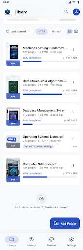
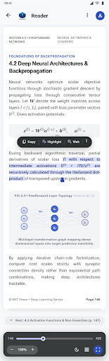
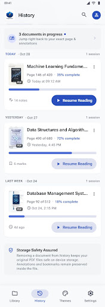
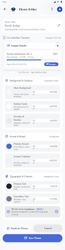

# PageNest PDF

<p align="center">
  
</p>

<p align="center">
  <b>A modern native Android PDF reader with folder-based document management, persistent reading progress, and customizable application themes.</b>
</p>

<p align="center">
  
  
  
  
</p>

---

## 🌟 Overview

**PageNest PDF** is a native Android application built with **Kotlin** and **Jetpack Compose**. Unlike basic PDF viewers that only open isolated files, PageNest PDF provides:
- **Folder-based document discovery** via Android's Storage Access Framework (SAF).
- **Zero-loss reading continuity** that automatically restores your exact reading position upon reopen.
- **Strict Document Integrity:** Application themes, dark mode, and appearance customizations apply solely to the user interface chrome. PDF pages remain 100% true to their original formatting, typography, colors, and embedded figures.
- **Custom Theme Engine:** Built-in presets (Light, Dark, Midnight, AMOLED Black, Forest, Ocean, Paper) alongside a live interactive Theme Editor.

---

## 📸 Visual Showcase

| Document Library (Grid & List) | High-Performance Reader |
|:---:|:---:|
|  |  |

| Reading History & Progress | Themes & Custom Editor |
|:---:|:---:|
|  |  |

---

## ✨ Features

- 📁 **SAF Folder Selection:** Authorize document folders once with persistent Android permissions.
- 🔄 **Direct & Recursive Scanning:** Choose between immediate folder scanning or deep subfolder traversal in Settings.
- 📖 **Distraction-Free PDF Reader:**
  - High-resolution rendering with Android `PdfRenderer`.
  - 24MB in-memory LRU bitmap cache for instantaneous page scrolling.
  - Pinch-to-zoom gestures (1.0x to 3.0x) and Fit-to-Width action.
  - Floating dark scrubber capsule with interactive slider and page readouts (`Page 146 / 420`).
  - Jump directly to any page number.
- 🔍 **In-Document Search & Bookmarks:**
  - Fast keyword search with previous/next occurrence navigation.
  - Single-tap page bookmarks with a saved bookmarks slide-over drawer.
- 🕒 **Reading Continuity & History:**
  - Debounced position tracking that saves progress without database lag.
  - History screen with percentage indicators (`35% completed`) and one-tap resume.
- 🎨 **Dynamic Material 3 Theming:**
  - 7 curated built-in theme presets.
  - Interactive Theme Editor with live preview cards and color pickers.
  - Instant theme switching without restarting the application.
- 🔒 **Privacy & Offline First:** Zero remote tracking, zero network permissions required.

---

## 🏗️ System Architecture

```text
PageNest PDF
│
├── data/
│   ├── local/          # Room DB (Documents, ReadingProgress, CustomThemes, Bookmarks)
│   ├── preferences/    # Jetpack DataStore preferences (view mode, scan depth, themes)
│   └── repository/     # Repositories exposing reactive Kotlin Flows
│
├── domain/
│   ├── manager/        # FolderAccessManager (SAF crawler), PdfViewerManager (PdfRenderer & cache)
│   └── model/          # PdfDocument, ReadingProgress, AppTheme, Enums
│
└── ui/
    ├── components/     # BottomNavigationBar, SearchBar, DocumentCards, ScrubberCapsule
    ├── navigation/     # NavHost and screen destinations
    ├── screens/        # Library, Reader, History, Themes, Theme Editor, Settings
    └── theme/          # Calibrated Material 3 tokens, Type scale, ThemePresets
```

---

## 🛠️ Development & Building

### Prerequisites
- **JDK 17** (e.g. Eclipse Adoptium OpenJDK 17)
- **Android SDK Platform 34** (compileSdk 34, minSdk 26)
- **Visual Studio Code** (with Kotlin/Android extensions) or **Android Studio Hedgehog+**

### Build Commands
```bash
# Clone the repository
git clone https://github.com/layzabhi/pagenest.git
cd pagenest

# Build debug APK
./gradlew assembleDebug

# Run unit tests
./gradlew test
```

---

## 📄 License
This project is open source under the standard MIT License.
